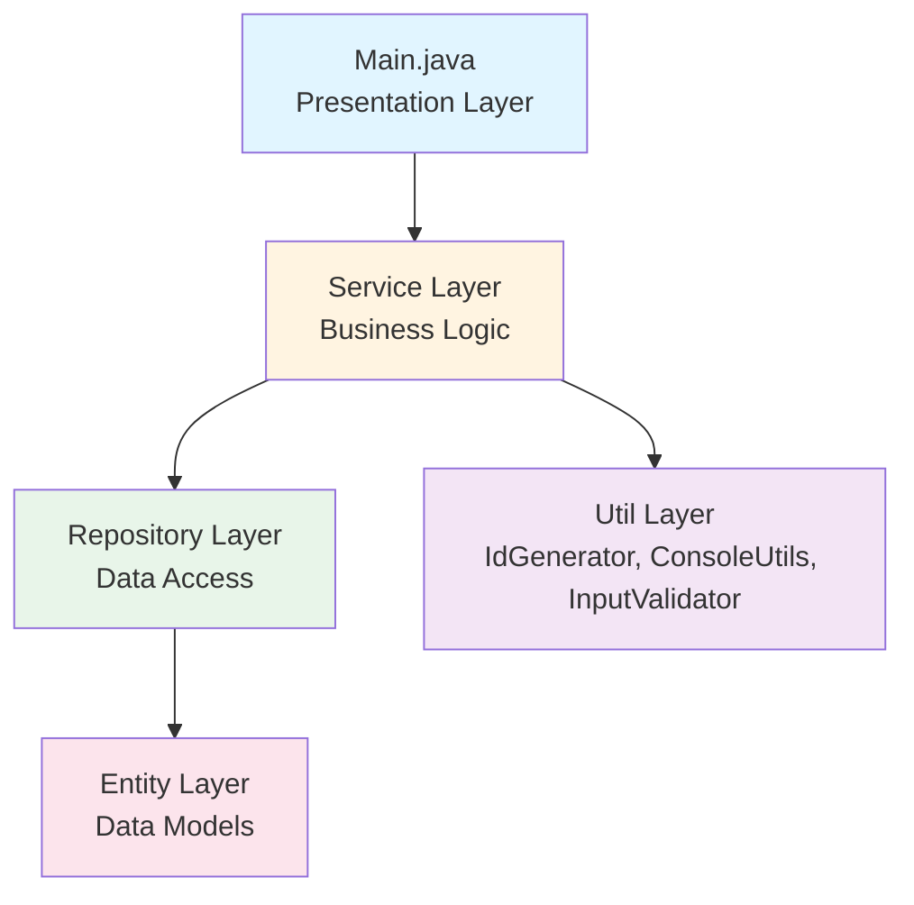
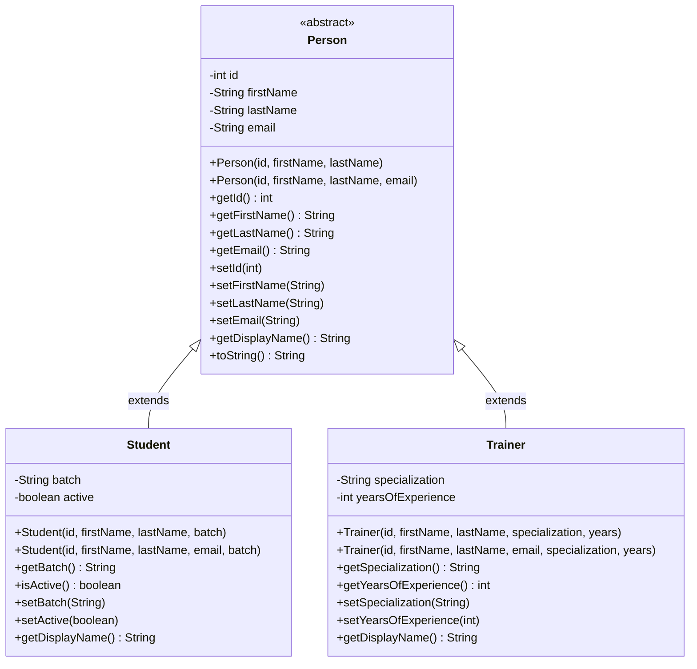
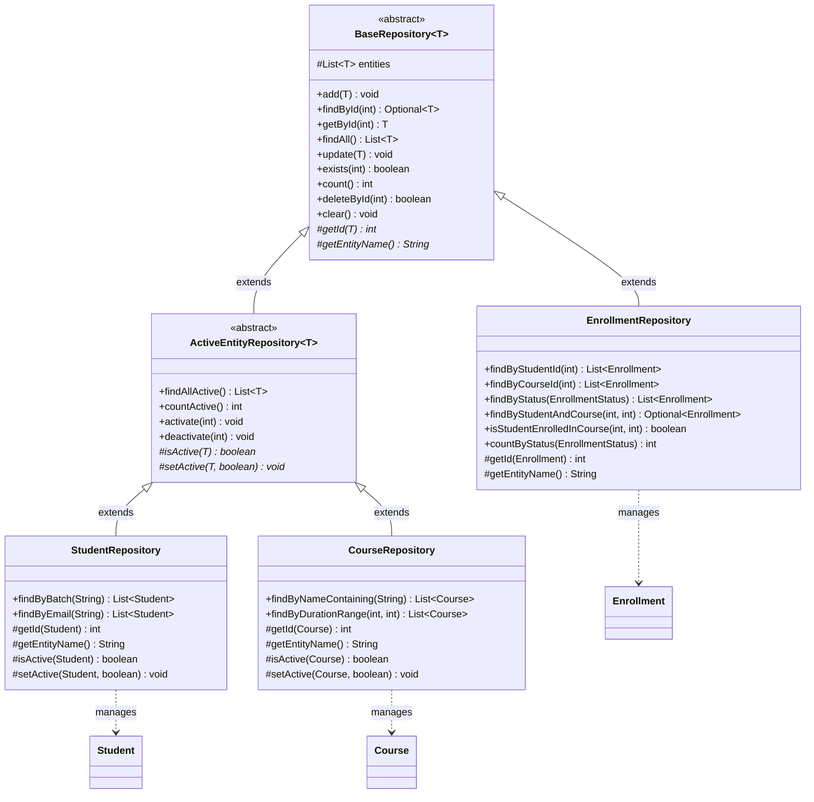
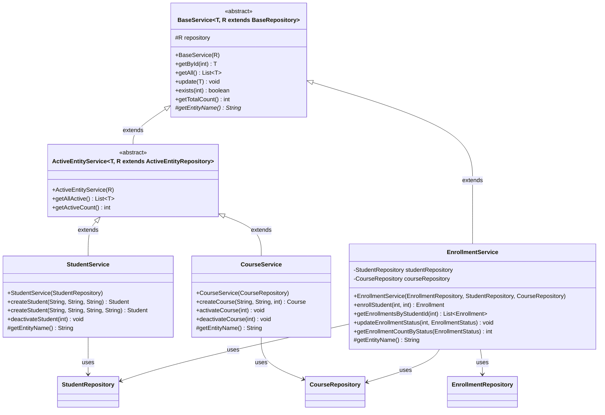
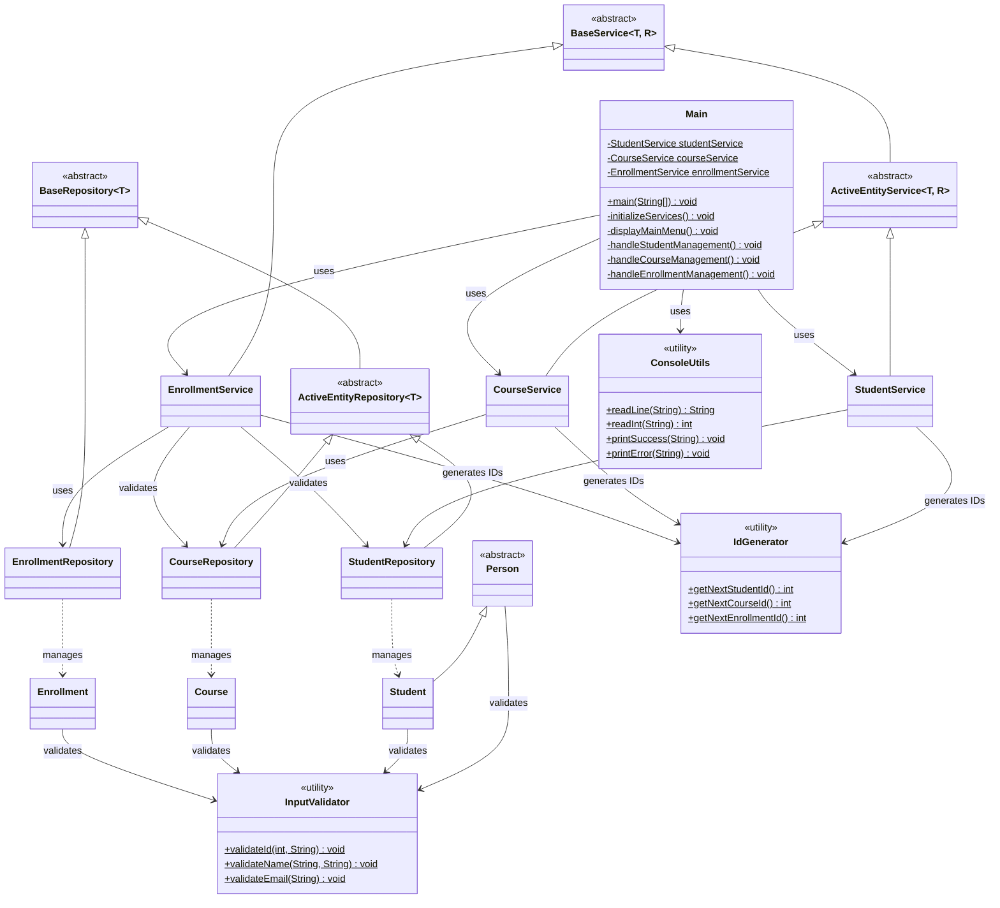
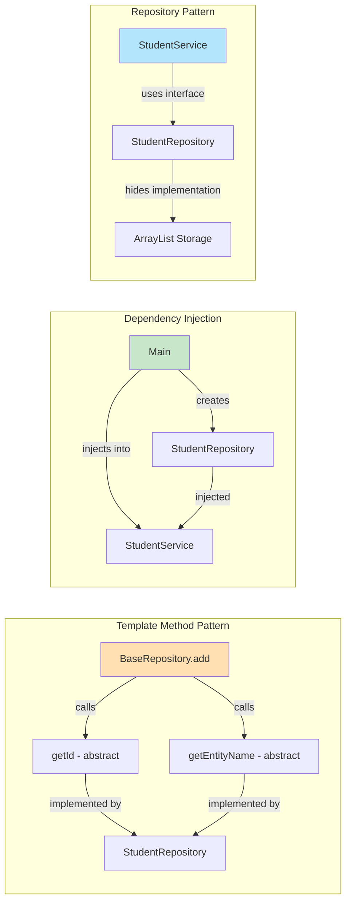

# LearnTrack - Course Management System

A Java-based console application for managing students, courses, and enrollments. This project demonstrates core Java programming concepts including Object-Oriented Programming (OOP), generics, abstract classes, inheritance, and clean code practices.

## Project Overview

LearnTrack is a course management system that allows users to:
- Manage students (add, view, search, activate/deactivate)
- Manage courses (add, view, search, activate/deactivate)
- Handle enrollments (enroll students in courses, update status, view enrollments)
- Track system statistics (student count, course count, enrollment status)

The system uses an in-memory data store with a layered architecture following best practices for separation of concerns.

## Key Features

- **Student Management**: Create students with/without email, track batches, manage active status
- **Course Management**: Create courses with duration tracking, manage course availability
- **Enrollment Management**: Enroll students in courses, track enrollment status (ACTIVE, COMPLETED, CANCELLED)
- **Business Validation**: Prevents duplicate enrollments, validates entity existence, ensures data integrity
- **ID Range Management**: Automatic ID generation with dedicated ranges for different entity types
- **Console UI**: Interactive menu-driven interface with input validation and error handling

## Technology Stack

- **Language**: Java 21+ (uses modern Java features)
- **Build Tool**: Gradle 9.2.0
- **JDK**: OpenJDK 25.0.1
- **Key Java Features Used**:
  - Generics with bounded type parameters
  - Abstract classes and inheritance
  - Stream API and lambda expressions
  - Optional for null safety
  - Enum types
  - Custom exceptions

## Project Structure

```
LearnTrack/
├── src/main/java/com/airtribe/learntrack/
│   ├── entity/               # Entity classes (Person, Student, Course, Enrollment)
│   ├── repository/           # Data access layer (BaseRepository, ActiveEntityRepository, etc.)
│   ├── service/              # Business logic layer (StudentService, CourseService, etc.)
│   ├── exception/            # Custom exceptions
│   ├── enums/                # Enum types (EnrollmentStatus)
│   ├── util/                 # Utility classes (IdGenerator, ConsoleUtils, InputValidator)
│   └── Main.java             # Application entry point
├── docs/                     # Documentation
│   ├── Design_Notes.md       # Design decisions and explanations
│   ├── Repository_Design.md  # Repository layer architecture
│   └── JVM_Basics.md         # JVM concepts
├── build.gradle              # Gradle build configuration
└── README.md                 # This file
```

## How to Compile

### Prerequisites
- Java Development Kit (JDK) 21 or higher
- Gradle 9.x (or use the included Gradle wrapper)

### Build the Project

Using Gradle wrapper (recommended):
```bash
# On macOS/Linux
./gradlew build

# On Windows
gradlew.bat build
```

This will:
- Compile all Java source files
- Run any tests (if configured)
- Create a JAR file in `build/libs/`

### Verify Compilation
After a successful build, you should see:
```
BUILD SUCCESSFUL in [time]
```

## How to Run

### Method 1: Using Gradle (Recommended)
```bash
# On macOS/Linux
./gradlew run

# On Windows
gradlew.bat run
```

### Method 2: Using Java directly
```bash
# Build first
./gradlew build

# Run the JAR
java -jar build/libs/LearnTrack-1.0-SNAPSHOT.jar
```

### Method 3: Using IDE
1. Open the project in IntelliJ IDEA or Eclipse
2. Navigate to `src/main/java/com/airtribe/learntrack/Main.java`
3. Right-click and select "Run 'Main.main()'"

## Usage

Once the application starts, you'll see an interactive menu:

```
============================================================
  LearnTrack - Course Management System
============================================================

--- Main Menu ---
1. Student Management
2. Course Management
3. Enrollment Management
4. View Statistics
0. Exit
------------------------------------------------------------
```

### Student Management
- **Add New Student**: Create student with first name, last name, batch, and optional email
- **View All Students**: List all students with their details
- **Search Student by ID**: Find a specific student
- **Deactivate Student**: Mark a student as inactive

### Course Management
- **Add New Course**: Create course with name, description, and duration
- **View All Courses**: List all courses
- **Search Course by ID**: Find a specific course
- **Activate/Deactivate Course**: Manage course availability

### Enrollment Management
- **Enroll Student in Course**: Create new enrollment with validation
- **View Enrollments by Student**: See all courses a student is enrolled in
- **View All Enrollments**: List all enrollments in the system
- **Update Enrollment Status**: Change status to ACTIVE, COMPLETED, or CANCELLED

### Statistics
View counts of:
- Total and active students
- Total and active courses
- Enrollments by status (active, completed, cancelled)

## Architecture & Class Diagrams

### Top-Level Architecture

The application follows a clean layered architecture with clear separation of concerns:



### Entity Class Hierarchy

Demonstrates inheritance and polymorphism with Person as the base class:



### Repository Class Hierarchy

Multi-level inheritance demonstrating the Template Method pattern and generics:



### Service Class Hierarchy

Mirrors the repository pattern with dependency injection:



### Complete System Class Relationships

Shows how all layers interact in the complete system:



### Key Design Patterns Visualized



### Design Patterns Used
- **Template Method Pattern**: BaseRepository defines structure, subclasses implement details
- **Dependency Injection**: Services receive repositories through constructors
- **Repository Pattern**: Abstracts data access from business logic
- **Factory Pattern**: IdGenerator provides centralized ID creation
- **Singleton Pattern**: ConsoleUtils uses static Scanner instance

## Code Quality

This project follows clean code principles:

- **Meaningful Names**: `addStudent()`, `findCourseById()`, not `fun1()` or `doWork()`
- **Single Responsibility**: Each class has one clear purpose
- **Short Methods**: Most methods are under 20 lines
- **DRY Principle**: Common code abstracted to base classes
- **Encapsulation**: All fields are private with controlled access
- **Input Validation**: All user inputs validated before processing
- **Error Handling**: Custom exceptions with meaningful messages

## Learning Objectives

This project demonstrates:

1. **Object-Oriented Programming**:
   - Inheritance (Person → Student/Trainer)
   - Polymorphism (method overriding, generic types)
   - Encapsulation (private fields, public methods)
   - Abstraction (abstract classes and methods)

2. **Java Generics**:
   - Generic classes (`BaseRepository<T>`)
   - Bounded type parameters (`R extends BaseRepository<T>`)
   - Type safety and compile-time checking

3. **Modern Java Features**:
   - Stream API for collection processing
   - Optional for null safety
   - Lambda expressions and method references
   - Switch expressions

4. **Software Design**:
   - Layered architecture
   - Separation of concerns
   - SOLID principles
   - Code reusability through abstraction

## Documentation

For detailed design decisions and explanations:
- [Design Notes](docs/Design_Notes.md) - Why ArrayList? Why static members? Inheritance benefits?
- [Repository Design](docs/Repository_Design.md) - Detailed repository layer architecture
- [JVM Basics](docs/JVM_Basics.md) - JVM concepts and memory management

## ID Ranges

The system uses predefined ID ranges for different entity types:
- Persons:     100 - 999    (900 IDs)
- Students:    1000 - 1999  (1000 IDs)
- Courses:     2000 - 2999  (1000 IDs)
- Enrollments: 3000 - 3999  (1000 IDs)
- Trainers:    4000 - 4999 (1000 IDs)

## Sample Data Flow

1. User selects "Add New Student" from menu
2. Main.java calls `StudentService.createStudent()`
3. StudentService generates ID via `IdGenerator.getNextStudentId()`
4. StudentService creates Student entity with validation
5. StudentService calls `StudentRepository.add()`
6. StudentRepository stores student in ArrayList
7. Success message displayed to user

## Contributing

This is an educational project. Feel free to:
- Add new features (e.g., Trainer management)
- Improve validation logic
- Add persistence (file I/O, database)
- Implement search and filtering
- Add unit tests

